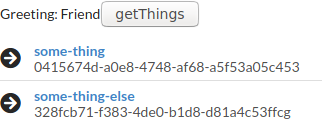

<h1 align="center">Welcome to Rails React Tutorial 👋</h1>

This project is a tutorial app with Ruby on Rails and React.
The instruction can be found [Free Code Camp](https://www.freecodecamp.org/news/how-to-create-a-rails-project-with-a-react-and-redux-front-end-8b01e17a1db/).



## Built With

- Ruby 2.6
- Rails 6.0
- React
- Redux
- Semantic UI

## Getting started

> Clone the repository to your local machine

```
$ git clone https://github.com/shjang7/rails-react-tutorial.git
```

> Change directory into the directory

```
$ cd rails-react-tutorial
```

> Create database

```
$ rails db:create
```

> Install the needed gems:

```
$ bundle install
```

> Install dependency

```
$ yarn install
```

> Open server

```
$ rails server
```

> Go to `http://localhost:3000/hello` using your browser.
